# 🧩 如何开发一款 VS Code 插件

官方文档：https://code.visualstudio.com/api/

其他文档：https://liiked.github.io/VS-Code-Extension-Doc-ZH/#/

# 一、概述

vscode 是作为前端开发者最常用的代码编辑器了，在 vscode 的扩展中有非常多的插件，能够帮助我们提高开发效率，增强 vscode 功能，那么你有没有想过自己去开发一款 vscode 插件呢？下面跟着本文一起学习如何开发 vscode 插件。

首先，我们先说说 vscode 插件可以做些什么：

- 主题设置：通过颜色或文件图标主题更改 VS Code 的外观
- 扩展工作区：在用户界面中添加自定义组件和视图
- Webview：创建一个 Webview 来显示使用 HTML/CSS/JS 构建的自定义网页
- 语言扩展：支持一种新的编程语言
- 调试扩展：支持调试特定的运行时环境

话不多说，开始进入我们的开发之旅吧！

# 二、开发准备

首先安装我们的 node 环境（当前使用的是 Node v20.18.3），这步网上都有教程（略）

官方文档：https://code.visualstudio.com/api/get-started/your-first-extension

## 1、安装 cli

安装 [Yeoman](https://yeoman.io/) 和 [VS Code Extension Generator](https://www.npmjs.com/package/generator-code)

```bash
npm install -g yo generator-code
```

不想全局安装也可以使用下面的命令：（这一步直接到初始化项目）

```bash
npx --package yo --package generator-code -- yo code
```

> 这两个库是干嘛的呢？
>
> Yeoman：是一个用于快速生成项目脚手架的开源工具库
>
> VS Code Extension Generator：是 Yeoman 的一个官方生成器（Generator），专门用于快速创建 Visual Studio Code 扩展（插件）的项目脚手架。

## 2、初始化项目

```bash
yo code
```

输入完成后，终端会有以下内容：

```bash
yo code

     _-----_     ╭──────────────────────────╮
    |       |    │   Welcome to the Visual  │
    |--(o)--|    │   Studio Code Extension  │
   `---------´   │        generator!        │
    ( _´U`_ )    ╰──────────────────────────╯
    /___A___\   /
     |  ~  |
   __'.___.'__
 ´   `  |° ´ Y `

? What type of extension do you want to create? (Use arrow keys)
❯ New Extension (TypeScript)
  New Extension (JavaScript)
  New Color Theme
  New Language Support
  New Code Snippets
  New Keymap
  New Extension Pack
  New Language Pack (Localization)
  New Web Extension (TypeScript)
  New Notebook Renderer (TypeScript)
```

这里我们就默认选择第一个就行

```bash
yo code

     _-----_     ╭──────────────────────────╮
    |       |    │   Welcome to the Visual  │
    |--(o)--|    │   Studio Code Extension  │
   `---------´   │        generator!        │
    ( _´U`_ )    ╰──────────────────────────╯
    /___A___\   /
     |  ~  |
   __'.___.'__
 ´   `  |° ´ Y `

? What type of extension do you want to create? New Extension (TypeScript) # 上一步选择的模版
? What's the name of your extension? vs-demo # 插件名称，小写，并且不能有空格
? What's the identifier of your extension? vs-demo # 插件标识，跟着上面的默认就行
? What's the description of your extension? 这是一个vscode插件demo # 插件描述
? Initialize a git repository? Yes # 是否初始化git
? Which bundler to use? webpack # 使用的打包工具
? Which package manager to use? pnpm # 使用的包管理器
```

## 3、认识项目结构

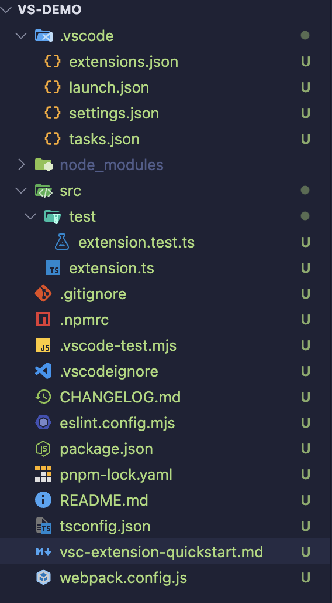

### 3.1 .vscode 目录

- extensions.json：推荐 VS Code 扩展列表，团队协作时统一开发依赖的扩展（比如推荐 ESLint、Prettier 等）
- launch.json：调试配置文件，定义 VS Code 的调试启动方式（比如 Node.js 调试、扩展调试的入口、参数）
- settings.json：项目级 VS Code 设置，覆盖全局设置，可配置代码格式化、校验规则等
- tasks.json：定义 VS Code 的任务（比如编译、打包、测试脚本），通过 Ctrl/Cmd + Shift + B 触发

> 这个目录平时很少接触，等下调试需要用到 `launch.json`

### 3.2 package.json

这个文件也很重要，包括事件激活，命令注册等，`activationEvents` 和 `contributes` 字段下面会细说

```json
{
  "name": "vs-demo", // 扩展的唯一标识符（在 VS Code 市场中必须唯一），只能包含小写字母、数字和连字符
  "displayName": "vs-demo", // 在 VS Code 市场和扩展面板中显示的名称
  "description": "这是一个vscode插件demo", // 扩展的简要描述，显示在市场列表中
  "version": "0.0.1",
  "engines": {
    // 运行环境
    "vscode": "^1.101.0" // 指定扩展兼容的 VS Code 版本范围（^1.101.0 表示兼容 1.101.0 及以上，但不包括 2.0.0）
  },
  "categories": [
    // 扩展在 VS Code 市场中的分类（如 Other、Programming Languages、Snippets 等）
    "Other"
  ],
  "activationEvents": [], // 激活事件，例如：
  /**
    "onCommand:vs-demo.helloWorld"：用户执行命令时激活。
    "onStartupFinished"：VS Code 启动完成后激活。
    "onLanguage:python"：打开特定语言文件时激活。
  */
  "main": "./dist/extension.js",
  "contributes": {
    // 定义扩展向 VS Code 贡献的功能
    /**
    - commands：注册命令（可通过 Ctrl/Cmd + Shift + P 调用）。
    	- command：命令的唯一标识符（格式：扩展名称.命令名）。
    	- title：命令在命令面板中显示的名称。
    - 其他常见贡献点：
    	- menus：自定义菜单（如编辑器右键菜单）。
    	- keybindings：快捷键绑定。
    	- configuration：用户可配置的设置项。
    	- views：侧边栏视图。
    */
    "commands": [
      {
        "command": "vs-demo.helloWorld",
        "title": "Hello World"
      }
    ]
  },
  "scripts": {
    "vscode:prepublish": "pnpm run package",
    "compile": "webpack",
    "watch": "webpack --watch",
    "package": "webpack --mode production --devtool hidden-source-map",
    "compile-tests": "tsc -p . --outDir out",
    "watch-tests": "tsc -p . -w --outDir out",
    "pretest": "pnpm run compile-tests && pnpm run compile && pnpm run lint",
    "lint": "eslint src",
    "test": "vscode-test"
  },
  "devDependencies": {
    "@types/vscode": "^1.101.0",
    "@types/mocha": "^10.0.10",
    "@types/node": "20.x",
    "@typescript-eslint/eslint-plugin": "^8.31.1",
    "@typescript-eslint/parser": "^8.31.1",
    "eslint": "^9.25.1",
    "typescript": "^5.8.3",
    "ts-loader": "^9.5.2",
    "webpack": "^5.99.7",
    "webpack-cli": "^6.0.1",
    "@vscode/test-cli": "^0.0.10",
    "@vscode/test-electron": "^2.5.2"
  }
}
```

## 4、运行项目 Hello World

打开 `package.json` ，看到 `script` 字段，可以运行 `compile` 或者 `watch` 命令，配置`.vscode/launch.json` 配置调试命令。

如果是用脚手架生成的项目，直接点击“启动调试”，会自动执行命令，这时候就会打开一个新的 vscode 调试窗口


我们看一下初始化项目的逻辑：

- package.json：注册一个命令

```json
"contributes": {
  "commands": [
    {
      "command": "vs-demo.helloWorld", // 唯一就行
      "title": "Hello World" // Ctrl/Cmd + Shift + p 输入到命令窗口的内容
    }
  ]
}
```

- extension.ts

```ts
import * as vscode from 'vscode'

// 当插件被激活触发
export function activate(context: vscode.ExtensionContext) {
  console.log('Congratulations, your extension "vs-demo" is now active!')
  // 注册命令
  // 注意，这里注册的命令必须和 package.json 文件中的 contributes.commands 数组中的 command 命令配置的一致
  const disposable = vscode.commands.registerCommand(
    'vs-demo.helloWorld',
    () => {
      // 右下角展示提示信息
      vscode.window.showInformationMessage('Hello World from vs-demo!')
    }
  )
  // 事件入栈，将一个可释放资源（如事件订阅、命令注册等）添加到扩展上下文的清理列表中，确保在扩展停用时能够自动释放这些资源
  context.subscriptions.push(disposable)
}

// 当插件停用时触发
export function deactivate() {}
```

输入 `Ctrl/Cmd + Shift + P` 后，在命令框中输入 `package.json` 的 `contributes.commands` 的 `title` 字段：Hello World 后回车，就会在右下角出现提示信息

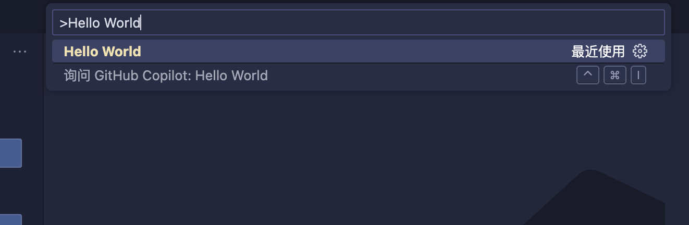

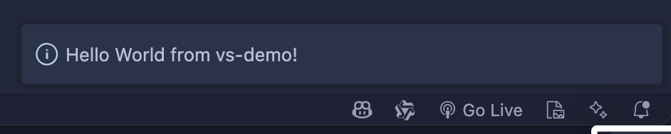

# 三、熟悉 VS Code 界面

官方文档：https://code.visualstudio.com/api/ux-guidelines/overview

在深入细节之前，了解 VS Code 的各种架构 UI 部分如何组合在一起，以及你的扩展如何以及在哪里做出贡献是很重要的。

我们需要了解各个界面对应的名称和位置，不然后面的内容您可能不知道说的是哪个位置的更改 😂。

VS Code 界面大致可分为两个主要概念：容器和子项。一般来说，容器可被视为 VS Code 界面中渲染一个或多个项目的较大区域：

- `Containers` 容器
- `Items` 子项，容器下的具体内容

## 1、Containers 容器


- [Activity Bar 活动栏](https://code.visualstudio.com/api/ux-guidelines/activity-bar)
- [Primary Sidebar 主侧边栏](https://code.visualstudio.com/api/ux-guidelines/sidebars#primary-sidebar)
- [Secondary Sidebar 次级侧边栏](https://code.visualstudio.com/api/ux-guidelines/sidebars#secondary-sidebar)
- Editor 编辑器
- [Panel 面板](https://code.visualstudio.com/api/ux-guidelines/panel)
- [Status Bar 状态栏](https://code.visualstudio.com/api/ux-guidelines/status-bar)

## 2、Items 子项


- [View 视图](https://code.visualstudio.com/api/ux-guidelines/views)：视图可以以树视图(`Tree View`)、欢迎视图(`Welcome View`)或 Webview 视图(`Webview View`)的形式进行贡献
- View Toolbar 视图工具栏
- Sidebar Toolbar 侧边栏工具栏
- Editor Toolbar 编辑器工具栏
- Panel Toolbar 面板工具栏
- Status Bar Item 状态栏项

## 3、Common UI Elements 通用 UI 元素

- Command Palette 命令面板
- Quick Pick 快速选择：和命令面板类似，在同一个位置
- Notifications 通知：右下角通知
- Webviews

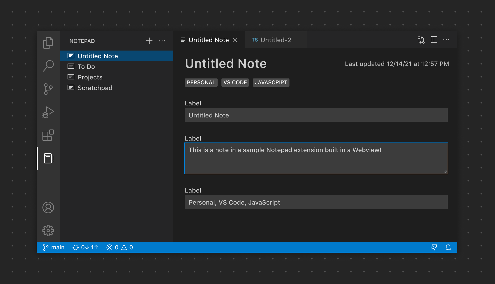

- Context Menus 上下文菜单：与命令面板的固定位置不同，上下文菜单允许用户从特定位置执行操作或进行配置。

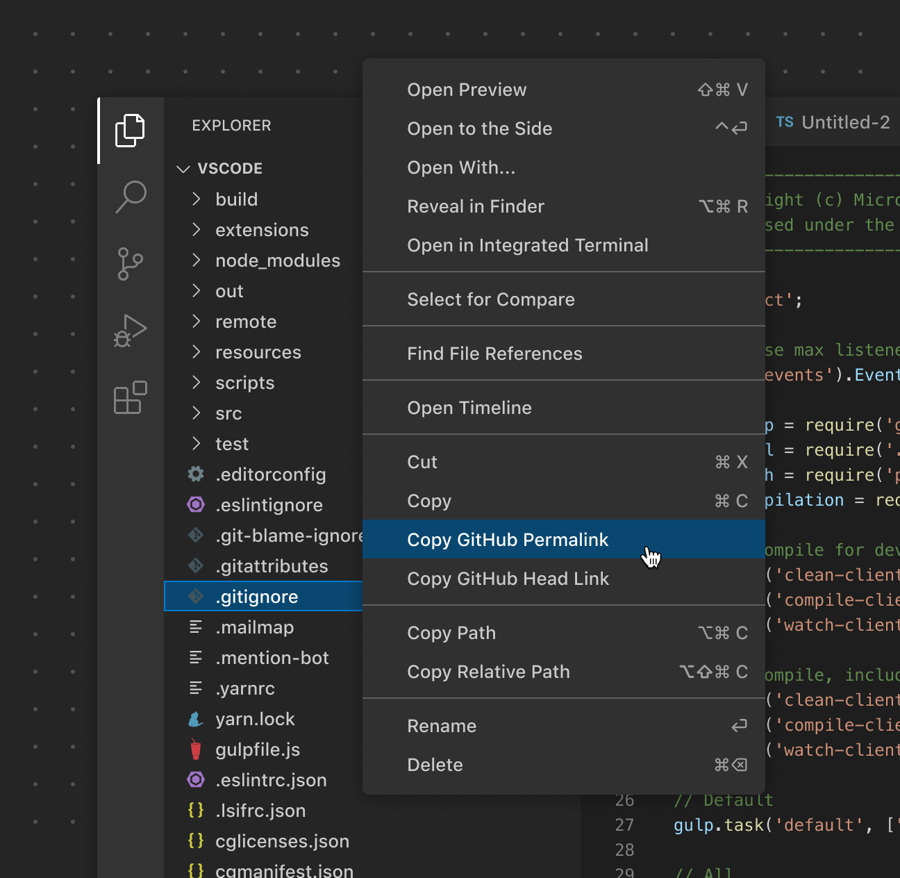

- Walkthroughs 快速入门：快速入门通过一个包含丰富内容的分步检查清单，为用户提供了使用扩展的统一体验。就是 vscode 打开的开始界面。
- Settings 设置

# 四、package.json 的 activationEvents 字段

官方文档：https://code.visualstudio.com/api/references/activation-events

`activationEvents` 激活事件，当激活事件发生时，你的扩展会被激活。以下是所有可用的激活事件列表：

- [`onAuthenticationRequest`](https://code.visualstudio.com/api/references/activation-events#onAuthenticationRequest)
- [`onChatParticipant`](https://code.visualstudio.com/api/references/activation-events#onChatParticipant)
- [`onCommand`](https://code.visualstudio.com/api/references/activation-events#onCommand)
- [`onCustomEditor`](https://code.visualstudio.com/api/references/activation-events#onCustomEditor)
- `onDebug`
  - [`onDebugAdapterProtocolTracker`](https://code.visualstudio.com/api/references/activation-events#onDebugAdapterProtocolTracker)
  - [`onDebugDynamicConfigurations`](https://code.visualstudio.com/api/references/activation-events#onDebugDynamicConfigurations)
  - [`onDebugInitialConfigurations`](https://code.visualstudio.com/api/references/activation-events#onDebugInitialConfigurations)
  - [`onDebugResolve`](https://code.visualstudio.com/api/references/activation-events#onDebugResolve)
- [`onEditSession`](https://code.visualstudio.com/api/references/activation-events#onEditSession)
- [`onFileSystem`](https://code.visualstudio.com/api/references/activation-events#onFileSystem)
- [`onIssueReporterOpened`](https://code.visualstudio.com/api/references/activation-events#onIssueReporterOpened)
- [`onLanguage`](https://code.visualstudio.com/api/references/activation-events#onLanguage)：当打开一个解析为特定语言的文件时，将发出此激活事件，相关的扩展将被激活
- [`onLanguageModelTool`](https://code.visualstudio.com/api/references/activation-events#onLanguageModelTool)
- [`onNotebook`](https://code.visualstudio.com/api/references/activation-events#onNotebook)
- [`onOpenExternalUri`](https://code.visualstudio.com/api/references/activation-events#onOpenExternalUri)
- [`onRenderer`](https://code.visualstudio.com/api/references/activation-events#onRenderer)
- [`onSearch`](https://code.visualstudio.com/api/references/activation-events#onSearch)
- [`onStartupFinished`](https://code.visualstudio.com/api/references/activation-events#onStartupFinished)
- [`onTaskType`](https://code.visualstudio.com/api/references/activation-events#onTaskType)
- [`onTerminalProfile`](https://code.visualstudio.com/api/references/activation-events#onTerminalProfile)
- [`onUri`](https://code.visualstudio.com/api/references/activation-events#onUri)
- [`onView`](https://code.visualstudio.com/api/references/activation-events#onView)
- [`onWalkthrough`](https://code.visualstudio.com/api/references/activation-events#onWalkthrough)
- [`onWebviewPanel`](https://code.visualstudio.com/api/references/activation-events#onWebviewPanel)
- [`workspaceContains`](https://code.visualstudio.com/api/references/activation-events#workspaceContains)
- [`*`](https://code.visualstudio.com/api/references/activation-events#Start-up)

这里的事件还是挺多的，我们举例**onLanguage**试试：

`onLanguage` 当打开一个解析为特定语言的文件时，将发出此激活事件，相关的扩展将被激活。`onLanguage` 事件接受一个语言标识符值。

```json
"activationEvents": [
    "onLanguage:json",
    "onLanguage:markdown",
    "onLanguage:typescript"
]
```

> 1. 在从 VS Code 1.74.0 版本开始，您的扩展所贡献(`contributes`)的语言不再需要相应的 `onLanguage` 激活事件声明，您的扩展就会被激活。
> 2. 也就是如果插件**贡献**了某个语言相关的功能（如语法高亮、补全等），则无需再显式声明 `"onLanguage:xxx"` 激活事件，但不是无条件默认激活的，有些情况还是需要书写`activationEvents`。
> 3. 什么是“**你贡献了该语言的功能**”，例如：
>    - 提供了该语言的语义高亮
>    - 注册了该语言的代码片段
>    - 实现了该语言的语言服务器客户端等

demo 需求：

1. 打开 ts 文件，点击右键展示“Open Ts File”，右下角展示消息提示

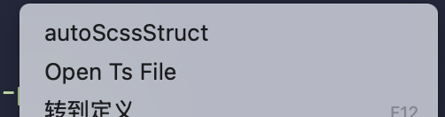

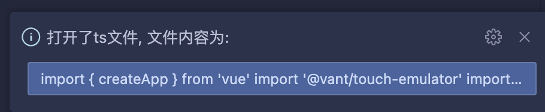

2. 底部状态栏展示打开的 ts 文件路径

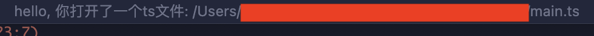

demo 步骤：

1. package.json

需要在 `contributes.commands` 注册命令，然后 `menus.['editor/context']` 向编辑器提供菜单项

```json
"activationEvents": [
  "onLanguage:typescript"
],
"contributes": {
  "commands": [
    {
      "command": "open-ts-file", // 注册命令
      "title": "Open Ts File"
    }
  ],
  "menus": {
    "editor/context": [
      {
        "command": "open-ts-file",
        "when": "editorLangId == typescript || editorLangId == javascript", // 当遇到ts或js展示
        "group": "navigation"
      }
    ]
  }
},
```

2. src/extension.ts

```ts
import * as vscode from 'vscode'

export function activate(context: vscode.ExtensionContext) {
  console.log('Open Ts File 插件已激活!')

  // 注册命令（需求：打开ts文件，点击右键展示“Open Ts File”，右下角展示消息提示）
  const inspectCommand = vscode.commands.registerCommand(
    'open-ts-file',
    async () => {
      // 当前开发的编辑器窗口
      const editor = vscode.window.activeTextEditor
      if (!editor) {
        vscode.window.showInformationMessage(
          '请先打开一个TypeScript/JavaScript文件'
        )
        return
      }
      // 获取编辑器内容
      const document = editor.document
      const text = document.getText()
      try {
        // 右下角展示提示
        vscode.window.showInformationMessage('打开了ts文件, 文件内容为: ', text)
      } catch (error) {
        vscode.window.showErrorMessage(`失败: ${(error as Error).message}`)
      }
    }
  )

  // 注册文档打开事件监听（需求：底部状态栏展示打开的ts文件路径）
  const docOpenListener = vscode.workspace.onDidOpenTextDocument((document) => {
    if (['typescript', 'javascript'].includes(document.languageId)) {
      vscode.window.setStatusBarMessage(
        `hello, 你打开了一个ts文件: ${document.fileName}`,
        3000
      )
    }
  })

  // 添加到插件上下文以便清理
  context.subscriptions.push(inspectCommand)
  context.subscriptions.push(docOpenListener)
}

export function deactivate() {}
```

⚠️ 注意：官网上说 `activationEvents` 不写也会默认激活，但是在开发的时候发现当不写 `activationEvents.onLanguage` 时，`vscode.workspace.onDidOpenTextDocument` 默认不会触发，只有当右键点击"Open Ts File"菜单后才会激活。

原因是：这里只是监听了一个事件（比如 `vscode.workspace.onDidOpenTextDocument`），但没有为该语言提供任何具体贡献，则不会自动激活插件。至于当右键点击"Open Ts File"菜单后激活，是因为触发了`activate` 方法导致的激活，才开启的`onDidOpenTextDocument`监听，自然在这之前是不会显示提示内容。

# 五、package.json 的 contributes（贡献点）字段

`contributes` 配置项是整个插件的贡献点，表明这个插件有什么功能

官方文档：https://code.visualstudio.com/api/references/contribution-points

中文文档：https://liiked.github.io/VS-Code-Extension-Doc-ZH/#/references/contribution-points

- [`authentication`](https://code.visualstudio.com/api/references/contribution-points#contributes.authentication)：声明支持的身份验证提供程序（Authentication Providers）。这些提供程序允许插件在需要时请求用户登录，并安全地管理用户的凭据。
- [`colors`](https://code.visualstudio.com/api/references/contribution-points#contributes.colors)：主题颜色
- [`commands`](https://code.visualstudio.com/api/references/contribution-points#contributes.commands)：命令，通过 `control/cmd + shift + p `打开命令窗口进行输入来实现的
- [`customEditors`](https://code.visualstudio.com/api/references/contribution-points#contributes.customEditors)：自定义编辑器，例如：

  - 以图形化方式编辑 `.json` 或 `.xyz` 文件；
  - 实现一个可视化画布来编辑 `.draw` 文件。
  - 在 WebView 中展示和编辑数据。

- [`grammars`](https://code.visualstudio.com/api/references/contribution-points#contributes.grammars)：可以在这个配置项里设置描述语言的语法文件的路径，vscode 可以根据这个语法文件来自动实现语法高亮功能
- [`languages`](https://code.visualstudio.com/api/references/contribution-points#contributes.languages)：配置一门语言，引入一门新的语言或者加强 VS Code 已有的语言支持。
- [`icons`](https://code.visualstudio.com/api/references/contribution-points#contributes.icons)：按 ID 提供新图标以及默认图标
- [`iconThemes`](https://code.visualstudio.com/api/references/contribution-points#contributes.iconThemes)：icon 主题色
- [`menus`](https://code.visualstudio.com/api/references/contribution-points#contributes.menus)：自定义编辑器菜单，包括右键菜单、头部菜单
- [`submenus`](https://code.visualstudio.com/api/references/contribution-points#contributes.submenus)：子菜单作为可以贡献菜单项的占位符，子菜单要求在父菜单中显示 label
- [`terminal`](https://code.visualstudio.com/api/references/contribution-points#contributes.terminal)：终端
- [`themes`](https://code.visualstudio.com/api/references/contribution-points#contributes.themes)：颜色主题
- [`views`](https://code.visualstudio.com/api/references/contribution-points#contributes.views)：配置活动栏对应的 view 视图
- [`viewsContainers`](https://code.visualstudio.com/api/references/contribution-points#contributes.viewsContainers)：可以贡献自定义视图的视图容器
- [`viewsWelcome`](https://code.visualstudio.com/api/references/contribution-points#contributes.viewsWelcome)：引导页，向自定义视图贡献欢迎内容

`contributes`有非常的多内容（上面不完整），我们选上面有的部分内容进行使用演示

## 1、contributes.authentication

> 这部分源码可以在 git 的`contributes/authentication`目录下找到

`contributes.authentication` 的作用是在 VS Code 插件中声明支持的身份验证提供程序（Authentication Providers）。这些提供程序允许插件在需要时请求用户登录，并安全地管理用户的凭据。

具体来说：

- `id`: 是身份验证提供程序的唯一标识符，用于在代码中引用该提供者。
- `label`: 是显示给用户的名称，表示这个身份验证提供程序的用途。

```json
"contributes": {
  "authentication": [
    {
      "label": "GitHub",
      "id": "github" // 自定义的，vscode默认的是github，尽量避开
    },
    {
      "label": "Azure Dev Ops",
      "id": "azuredevops"
    }
  ]
}
```

这段配置表示插件支持通过 GitHub 进行身份验证。插件可以通过 `vscode.authentication.getSession("github", ...)` 等 API 获取用户登录状态和访问令牌。

要使用 `contributes.authentication` 中定义的身份验证提供程序（如 GitHub 和 Azure DevOps），你需要在插件代码中调用 VS Code 提供的认证 API 来获取用户的会话信息。

步骤展示如下：

### 1.1 申请 Github OAuth App

打开 github：https://github.com/settings/developers

点击 “New OAuth App”，申请一下，这里需要注意以下几点：

- Application name：应用名称
- Authorization callback URL：这个非常重要‼️，当授权成功后，会跳转的页面就是这个
- Client ID：后续向 github 发起登录请求时需要

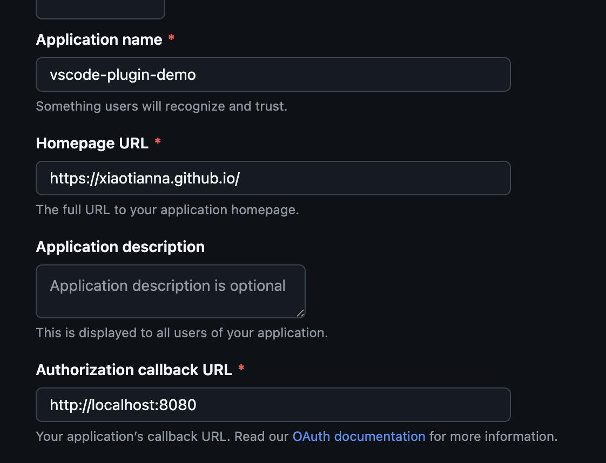

### 1.2 配置 package.json

- commands：新增两个命令，通过 `Ctrl/Cmd + Shift + P` 打开的命令面板输入，“Login Github”或者“Logout Github”会触发对应的激活回调

```json
"contributes": {
  "commands": [
    {
      "command": "vs-demo.loginGitHub",
      "title": "Login GitHub"
    },
    {
      "command": "vs-demo.logoutGitHub",
      "title": "Logout GitHub"
    }
  ],
  "authentication": [
    {
      "id": "my-github-provider",
      "label": "GitHub"
    }
  ]
},
```

### 1.3 extension.ts

- activate：当插件贡献点激活时触发

这里注册了三个事件：

1、自定义登录，对应 package.json 的`contributes.authentication`

2、登录命令`Login GitHub`：输入后触发登录

3、退出登录命令`Logout GitHub`

```ts
import * as vscode from 'vscode'

export async function activate(context: vscode.ExtensionContext) {
  // 初始化 GitHub 认证提供者
  const githubProvider = new GitHubAuthenticationProvider()

  // 使用 vscode.authentication.registerAuthenticationProvider 方法注册自定义身份验证提供者
  // 这一步让 VS Code 知道你的插件支持 GitHub 登录
  context.subscriptions.push(
    vscode.authentication.registerAuthenticationProvider(
      'my-github-provider', // 与package.json中的contributes.authentication的id一致
      'GitHub', // 与package.json中的contributes.authentication的label一致
      githubProvider
    )
  )

  // 绑定一个命令让用户主动触发登录
  context.subscriptions.push(
    vscode.commands.registerCommand('vs-demo.loginGitHub', async () => {
      // 当用户执行 vs-demo.loginGitHub 命令时，调用 getSession() 获取或创建一个 GitHub 登录会话
      const session = await vscode.authentication.getSession(
        'my-github-provider',
        // scopes，是你请求用户授权的权限范围。这些权限决定了你的应用可以访问用户的哪些资源。
        /**
         * 例如：
         * - user：最基本的权限，可读取用户公开信息（如用户名、邮箱等）
         * - repo：允许你的应用访问用户仓库，如创建、更新、删除仓库，权限最大
         * - public_repo：可访问公共仓库（读写）
         * ...等等
         */
        ['user'],
        // 如果没有现有会话且 { createIfNone: true }
        // 将触发 githubProvider 的 createSession 方法（即打开浏览器进行 OAuth 授权）
        { createIfNone: true }
      )
      if (session) {
        vscode.window.showInformationMessage(
          `已登录 GitHub：${JSON.stringify(session)}`
        )
      }
    })
  )

  // 退出登录
  context.subscriptions.push(
    vscode.commands.registerCommand('vs-demo.logoutGitHub', async () => {
      // 获取登录的会话session
      const sessions = await githubProvider.getSessions()
      if (sessions.length === 0) {
        vscode.window.showInformationMessage('当前没有活跃的 GitHub 会话')
        return
      }

      // 移除第一个会话（也可以根据需要选择多个）
      await githubProvider.removeSession(sessions[0].id)
      vscode.window.showInformationMessage('已退出 GitHub 登录')
    })
  )
}

export function deactivate() {}
```

- GitHubAuthenticationProvider：用于提供 GitHub 身份认证能力，支持登录、登出、获取会话等功能。重写`vscode.AuthenticationProvider`的方法即可

这里参考文档的时候，需要把代码中的`const client_id = xxx`部分填入自己的 client id 即可

```ts
// 实现了 vscode.AuthenticationProvider 接口
// 用于提供 GitHub 身份认证能力，支持登录、登出、获取会话等功能
class GitHubAuthenticationProvider implements vscode.AuthenticationProvider {
  // 用于向 VS Code 发送会话变更事件（新增、删除、修改），用来触发 onDidChangeSessions 事件
  private _sessionChangeEmitter =
    new vscode.EventEmitter<vscode.AuthenticationProviderAuthenticationSessionsChangeEvent>()
  // 本地存储用户身份会话信息
  private _sessions: vscode.AuthenticationSession[] = []

  // 提供给 VS Code 监听会话变化的接口
  get onDidChangeSessions() {
    return this._sessionChangeEmitter.event
  }

  // 返回当前所有已登录的 GitHub 会话
  async getSessions(): Promise<vscode.AuthenticationSession[]> {
    return this._sessions
  }

  async createSession(scopes: string[]): Promise<vscode.AuthenticationSession> {
    // 在 OAuth 2.0 认证流程中，state 参数是一个可选但强烈推荐使用的参数，后续可以判断服务器的state和本地生成的是否一致
    const state = Math.random().toString(36).substring(2)
    const port = 8080
    // 授权成功后，重定向地址
    const redirectUri = `http://localhost:${port}`
    // GitHub Client ID
    const client_id = 'xxxxx'
    // 构造 GitHub OAuth 登录链接
    const loginUrl = `https://github.com/login/oauth/authorize?client_id=${client_id}&scope=${scopes.join(
      '%20'
    )}&state=${state}&redirect_uri=${redirectUri}`

    // 打开浏览器进行授权
    vscode.commands.executeCommand('vscode.open', vscode.Uri.parse(loginUrl))

    // 启动本地 HTTP 服务器
    // 用于接收 GitHub OAuth 认证流程中的回调请求，并从回调 URL 中提取认证代码（code）
    const token = await new Promise<string>((resolve, reject) => {
      const server = require('http').createServer((req: any, res: any) => {
        // url：http://localhost:8080/?code=xxxxxxxx
        const url = new URL(req.url, redirectUri)
        const code = url.searchParams.get('code')
        // 如何有id，就向8080页面响应
        if (code) {
          res.end(`<script>
            document.write('<h1>GitHub Login Success, close after 3 seconds</h1></br><code>${code}</code>')
          </script>`)
          server.close()
          resolve(code)
        } else {
          res.writeHead(400)
          res.end('No code found')
          reject(new Error('No code in callback'))
        }
      })

      server.listen(port, () => {
        console.log(`Listening for GitHub auth callback on port ${port}`)
      })
    })

    // 模拟从 code 获取 access token（实际应调用 GitHub API）
    const accessToken = await this.exchangeCodeForToken(token)

    // 创建并保存 session
    const session: vscode.AuthenticationSession = {
      id: 'github-session-id',
      accessToken,
      scopes,
      account: { label: 'User', id: 'user-id' }
    }
    this._sessions.push(session)
    this._sessionChangeEmitter.fire({
      added: [session],
      removed: [],
      changed: []
    })

    return session
  }

  // 根据 sessionId 删除对应的会话
  async removeSession(sessionId: string): Promise<void> {
    const sessionIndex = this._sessions.findIndex(
      (session) => session.id === sessionId
    )
    if (sessionIndex > -1) {
      const deleted = this._sessions.splice(sessionIndex, 1)
      // 触发 onDidChangeSessions 事件通知 UI 更新
      this._sessionChangeEmitter.fire({
        added: [],
        removed: deleted,
        changed: []
      })
    }
  }

  private async exchangeCodeForToken(code: string): Promise<string> {
    // 这里应向 GitHub 发起请求，把这个 code 交换成 accessToken
    return 'mocked-access-token'
  }
}
```

### 1.4 测试

当输入“Login Github”，点击“允许”后，会展示下面的页面：


点击授权后，浏览器会跳转到`http://localhost:8080/?code=xxxxxxxx`页面，此时的 vscode 调试窗口已经底部出现登录信息：

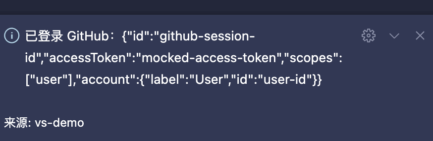

## 2、contributes.commands

官方文档：https://code.visualstudio.com/api/references/contribution-points#contributes.commands

`vscode.commands.registerCommand`仅仅是将命令 id 绑定到了处理函数上，如果想让用户从**命令面板**中找到你的命令，你还需要在`package.json`中配置对应的命令`配置项(contribution)：

```json
"contributes": {
  "commands": [
    {
      "command": "myExtension.sayHello",
      "title": "Say Hello"
    }
  ]
},
```

`commands`配置告诉 VS Code 你的插件提供了一个命令，而且允许你控制命令在 UI 中的显示。

这里就短暂讲讲，后续【九、Commands 命令】中会详细介绍。

## 3、contributes.menus

> 这部分源码可以在 git 的`contributes/menus`目录下找到

为编辑器或者文件管理器设置命令的菜单项。菜单项至少包含**选中时调用的命令**和**何时显示这个菜单项的时机**。

显示菜单的时机由 when 键定义，而对应的值语法需要参考键值绑定的[when 语法](https://code.visualstudio.com/api/references/when-clause-contexts)。

`menus` 的每一项包含以下键：

- `command`：菜单项所调用的命令，该键是必须的。
- `alt`：可选的命令使用 `alt` 定义，当你按下 `ALT` 键时，菜单中会显示对应的菜单项。
- `when`：可选的，定义何时显示这个菜单项，需要一个布尔值（参考用法：[when 语法](https://code.visualstudio.com/api/references/when-clause-contexts)）。
- `group`：可选的，定义菜单项的分组。

当前插件开发者可以配置的菜单的地方有：

- 全局命令面板 - `commandPalette`
- 资源管理器上下文菜单 - `explorer/context`
- 编辑器上下文菜单 - `editor/context`
- 编辑器标题栏 - `editor/title`
- 编辑器标题上下文菜单 - `editor/title/context`
- ...等等

> 可以去文档查看全部的菜单贡献点：https://code.visualstudio.com/api/references/contribution-points#contributes.menus

### 3.1、menus.commandPalette

全局命令面板中显示

在 package.json 中添加如下代码：

⚠️ 注：`menus` 中使用到的命令需要在 `commands` 中声明

```json
{
  "contributes": {
    "commands": [
      {
        "command": "vs-demo.loginGitHub", // 需要声明命令
        "title": "Login GitHub"
      }
    ],
    "menus": {
      "commandPalette": [
        {
          "command": "vs-demo.loginGitHub",
          "when": "editorHasSelection"
        }
      ]
    }
  }
}
```

需要选中内容后，在命令面板才会显示该命令

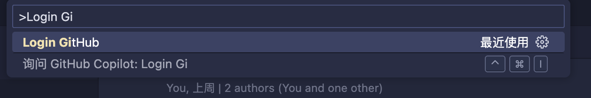

> 这里需要注意：
>
> 如果只在 `commands` 中声明命令，它会默认出现在命令面板（Command Palette）中；
>
> 但一旦你在 `commandPalette` 菜单项中自定义了这个命令并加上 `when` 条件后，就只有满足条件时才显示。

### 3.2、menus.explorer/context

资源管理器上下文菜单中显示

在 package.json 中添加如下代码：

```json
{
  "contributes": {
    "commands": [
      {
        "command": "vs-demo.loginGitHub", // 需要声明命令
        "title": "Login GitHub"
      }
    ],
    "menus": {
      "explorer/context": [
        {
          "command": "vs-demo.loginGitHub",
          "when": "true",
          "group": "navigation"
        }
      ]
    }
  }
}
```

点击文件目录（资源管理器）右键，展示效果：

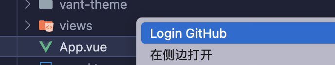

### 3.3 menus.editor/context

编辑器上下文菜单中新增菜单项

在 package.json 中添加如下代码：

```json
{
  "contributes": {
    "commands": [
      {
        "command": "vs-demo.loginGitHub", // 需要声明命令
        "title": "Login GitHub"
      }
    ],
    "menus": {
      "editor/context": [
        {
          "command": "vs-demo.loginGitHub",
          "when": "editorTextFocus && !editorReadonly",
          "group": "navigation"
        }
      ]
    }
  }
}
```

当鼠标在编辑器中时，点击鼠标右键，会出现如下菜单：

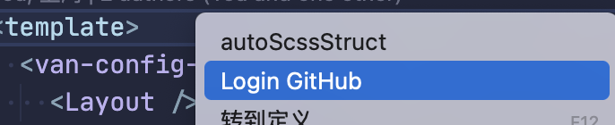

### 3.4 menus.editor/title

> 官方示例：https://code.visualstudio.com/api/references/contribution-points#menu-example

编辑器标题栏上新增按钮

在 package.json 中添加如下代码：

```json
{
  "contributes": {
    "commands": [
      {
        "command": "vs-demo.loginGitHub", // 需要声明命令
        "title": "Login GitHub"
      }
    ],
    "menus": {
      "editor/title": [
        {
          "when": "editorTextFocus && !editorReadonly",
          "command": "markdown.showPreview", // 添加按钮——主窗口markdown预览
          "alt": "markdown.showPreviewToSide", // 添加按钮——侧边栏markdown预览
          "group": "navigation"
        },
        {
          "when": "editorTextFocus && !editorReadonly",
          "command": "vs-demo.loginGitHub",
          "alt": "vs-demo.loginGitHub",
          "group": "navigation"
        }
      ]
    }
  }
}
```

这里需要注意：vscode 内置的命令如果是带了图标的

```json
"command": "markdown.showPreview", // 添加按钮——主窗口markdown预览
"alt": "markdown.showPreviewToSide", // 添加按钮——侧边栏markdown预览
```

当聚焦在编辑器内，title 区域显示如下：

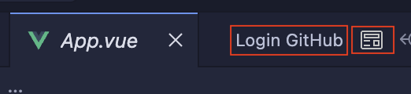

如果 `contributes.commands` 配置了和内置的命令一样，就会覆盖掉默认的

```json
{
  "contributes": {
    "commands": [
      // ...
      {
        "command": "markdown.showPreview",
        "title": "Markdown Preview"
      },
      {
        "command": "markdown.showPreviewToSide",
        "title": "Markdown Preview To Side"
      }
    ]
  }
}
```

### 3.5 分组排序

菜单项可以分组排序。它们按字母顺序排序，并遵循以下默认规则。您可以向这些组添加菜单项，或在其中添加新的菜单项组，也可以在上方、下方或中间添加。

1. **编辑器上下文菜单**默认有这些分组：

   - `navigation` - navigation 组始终在最上方。
   - `1_modification` - 紧接上一个组，这个组包含可以修改你代码的命令。
   - `9_cutcopypaste` - 然后是基础编辑命令。
   - `z_commands` - 最后一个分组则是命令面板入口。


2. **资源管理器上下文菜单**有这些默认分组：

   - `navigation` - 在 VS Code 中导航的相关命令。navigation 组始终在最上方。
   - `2_workspace` - 和工作区操作相关的命令。
   - `3_compare` - 比较文件和 diff 相关的命令。
   - `4_search` - 在搜索视图中和搜索相关的命令。
   - `5_cutcopypaste` - 和剪切、复制、粘贴文件相关的命令。
   - `7_modification` - 修改文件的相关命令。

3. **编辑器选项卡上下文菜单**有这些默认分组：

   - `1_close` - 和关闭编辑器相关的命令。
   - `3_preview` - 和固定编辑器相关的命令。

4. **编辑器标题菜单**包含这些默认分组：

   - `1_diff` - diff 编辑器相关的命令。
   - `3_open` - 打开编辑器的相关命令。
   - `5_close` - 和关闭编辑器相关的命令。

5. 还包括`终端选项卡上下文菜单`、`终端上下文菜单`、`时间轴视图项上下文菜单`、`扩展视图上下文菜单` 这些可以自行查阅文档

### 3.6 组内排序

组内的菜单顺序取决于标题或者序号属性。菜单的组内顺序由@<number>加到 group 值的后面得以确定：

```json
{
  "editor/title": [
    {
      "when": "editorHasSelection",
      "command": "extension.Command",
      "group": "myGroup@1"
    }
  ]
}
```

## 4. contributes.views

> 这部分源码可以在 git 的`contributes/views`目录下找到

为 VS Code 添加视图。你需要为视图指定唯一标识和名称。可以配置的属性如下：

- `explorer`: 活动栏中的资源管理视图容器。
- `scm`: 活动栏中的源代码管理(SCM) 视图容器。
- `debug`: 活动栏中的调试视图容器。
- `test`: 活动栏中的测试视图容器。
- [`Custom view containers`](https://code.visualstudio.com/api/references/contribution-points#contributes.viewsContainers) 由插件提供的自定义视图容器。

> views 的自定义视图容器需要 views 的 key 和 viewsContainers 的 ui 容器的 id viewsContainers 部分会说）

视图可以以**树视图**(`Tree View`)、**欢迎视图**(`Welcome View`)或 **Webview 视图**(`Webview View`)的形式进行贡献。

**需要注意**：每个视图都有个 `type` 属性，用于指定视图的类型，默认为 `tree`，可省（但是如果你渲染的类型是 `webview`，则需要设置 `type: webview`，否则渲染不出来，这里已经踩过坑了 😭）。

- `type: "tree"`: 该视图由 `createTreeView` 创建的 `TreeView` 提供支持。
- `type: "webview`: 该视图由 `registerWebviewViewProvider` 注册的 `WebviewView` 提供支持。

### 4.1、views.explorer

当用户打开视图，VS Code 会触发 `onView:${viewId}` 激活事件（比如：下面示例中的 `onView:nodeDependencies）`。你也可以用 when 控制视图的可见性。

1. package.json 文件中添加如下内容：

```json
{
  "activationEvents": [
    "onCommand:setContext" // 一定要添加
  ],
  "contributes": {
    "views": {
      "explorer": [
        {
          "id": "nodeDependencies-demo",
          "name": "Node Dependencies Demo",
          "when": "myCustomKey", // 自定义when子句，判断当前目录是否有package.json文件
          "icon": "$(package)", // 内置图标
          "contextualTitle": "Package Explorer" // 当视图移出其原始位置时的用户可读上下文。默认情况下，将使用视图的容器名称
        }
      ]
    }
  }
}
```

2. extension.ts

使用 `vscode.commands.executeCommand('setContext', 'myCustomKey', true)` 激活自定义 when 子句，这里可以自由判断当前目录是否有 package.json 文件，需要在 package.json 文件中配置 `"activationEvents": ["onCommand:extension.myCommandId"]`

使用 `createTreeView` 创建树视图，这里模拟了树结构。

```ts
import path from 'path'
import * as vscode from 'vscode'

class SimpleTreeProvider implements vscode.TreeDataProvider<string> {
  getTreeItem(element: string): vscode.TreeItem {
    const treeItem = new vscode.TreeItem(element)
    // 定义树结构item图标
    treeItem.iconPath = vscode.Uri.file(
      // react图标
      path.join(__filename, '..', '..', 'media', 'icon.svg')
    )
    // 使用内置图标
    // treeItem.iconPath = new vscode.ThemeIcon("folder");
    return treeItem
  }

  getChildren(): Thenable<string[]> {
    return Promise.resolve(['lodash', 'react', 'vue'])
  }
}

export function activate(context: vscode.ExtensionContext) {
  // 创建自定义when子句上下文
  vscode.commands.executeCommand('setContext', 'myCustomKey', true)
  const provider = new SimpleTreeProvider()
  vscode.window.createTreeView('nodeDependencies-demo', {
    treeDataProvider: provider
  })
}
```

3. 最终效果

当目录中有 package.json 文件时，资源管理器试图会新增“Node Dependencies Demo”栏，这里子项的图标就是 `media/icon.svg`

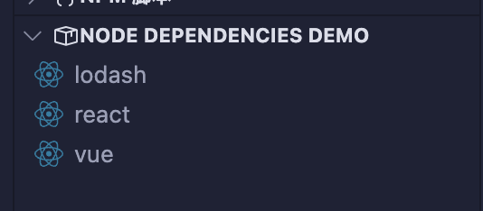

⚠️ 这里需要注意，我的 vscode 在 `Node Dependencies Demo` 前没有 icon 图标，也就是配置的`explorer.icon` 没有看到，原因是因为某个设置关掉了，我这里是把 vscode 的开发者工具打开了，发现一个类名为`codicon` 元素的 css 属性设置为了`display: none;`，导致图标被隐藏了，这里手动去掉即可。

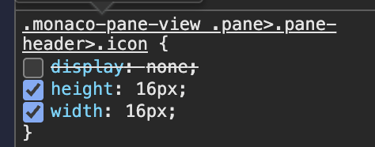

### 4.2、视图填充

视图填充就是当前的 views 视图下展示的内容，例如上面展示的是树结构。

视图的内容可以通过两种方式填充：

1. 通过 `createTreeView` API 提供数据提供者或通过 `registerTreeDataProvider` API 直接注册数据提供者来填充数据。`TreeView` 非常适合显示层次结构和列表数据。参考 [`tree-view-sample`](https://github.com/microsoft/vscode-extension-samples/tree/main/tree-view-sample)。

2. 通过 `registerWebviewViewProvider` 注册一个提供者来使用 `WebviewView`。Webview 视图允许在视图中渲染任意 HTML。参考[`webview-view-sample`](https://github.com/microsoft/vscode-extension-samples/tree/main/webview-view-sample)。

拿官方的 webview 的运行展示一下，等下会详细介绍

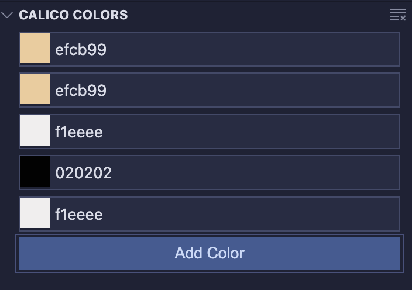

## 5、contributes.viewsContainers 自定义视图容器

配置**自定义视图的视图容器**。你需要为视图指定唯一标识和标题和图标。目前你只可以配置活动栏(`activitybar`)和面板(`panel`)。

下面的示例展示了如何将 `Package Explorer` 视图容器贡献到 `Activity Bar`，以及如何将视图贡献到其中。

下面拿 `viewsContainers.activitybar` 举例：

1、package.json 文件中添加如下内容：

⚠️ 这里要注意：`viewsContainers` 的可以为 `activitybar`、`panel` 只有这两个，他们是一个数组，可以定义多个视图容器。数组每一项的 `id` 属性，必须和 `views` 中定义的 `key` 值一致（`view` 的 `key` 值有内置的和自定义的值）。

```json
{
  "contributes": {
    "viewsContainers": {
      "activitybar": [
        {
          "id": "custom-package-explorer", // 视图容器的标识符
          "title": "Custom Package Explorer",
          "icon": "media/icon.svg"
        }
      ]
    },
    "views": {
      // 视图，与视图容器关联，与 activitybar 的每一项的id 属性一致
      "custom-package-explorer": [
        {
          "id": "package-dependencies-demo", // 自定义唯一值
          "name": "Dependencies Demo"
        },
        {
          "id": "package-outline-demo",
          "name": "Outline Demo"
        }
      ]
    }
  }
}
```

2、extension.ts

这个文件是用来提供 `view` 视图的，也就是展示的内容的，这里的示例代码是创建了两个树视图。

> 视图可以以**树视图**(`Tree View`)、**欢迎视图**(`Welcome View`)或 **Webview 视图**(`Webview View`)的形式进行贡献（上面说过）

```ts
import * as vscode from 'vscode'

export function activate(context: vscode.ExtensionContext) {
  // 创建一个 `DemoViewProvider` 对象，使用 implements 需要实现`vscode.TreeDataProvider`的方法
  const demoViewProvider = new DemoViewProvider()

  // 注册树视图
  vscode.window.registerTreeDataProvider(
    'package-dependencies-demo',
    demoViewProvider
  )
  vscode.window.registerTreeDataProvider(
    'package-outline-demo',
    demoViewProvider
  )
}

class DemoViewProvider implements vscode.TreeDataProvider<vscode.TreeItem> {
  private _onDidChangeTreeData: vscode.EventEmitter<
    vscode.TreeItem | undefined | void
  > = new vscode.EventEmitter<vscode.TreeItem | undefined | void>()
  readonly onDidChangeTreeData: vscode.Event<
    vscode.TreeItem | undefined | void
  > = this._onDidChangeTreeData.event

  getTreeItem(element: vscode.TreeItem): vscode.TreeItem {
    return element
  }

  getChildren(element?: vscode.TreeItem): Thenable<vscode.TreeItem[]> {
    if (element) {
      return Promise.resolve([])
    }

    const items = ['Dependency 1', 'Dependency 2', 'Group A'].map(
      (label) => new vscode.TreeItem(label)
    )

    return Promise.resolve(items)
  }

  refresh(): void {
    this._onDidChangeTreeData.fire()
  }
}
```

效果如下：

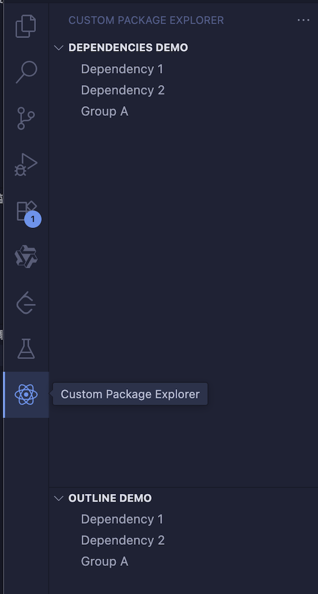

## 6、contributes.viewsWelcome

### 6.1 在内置的视图中添加欢迎页

在 package.json 中添加如下内容：

```json
{
  "contributes": {
    "viewsWelcome": [
      {
        "view": "workbench.explorer.emptyView", // 在默认的资源管理器中添加欢迎页（未打开文件夹的情况）
        "contents": "Hello World \n这个一个[命令链接](https://code.visualstudio.com)点击打开\n打开[internal commands](command:welcome-view-content-sample.hello).\n [Hello](command:welcome-view-content-sample.hello)\n[codicons](https://microsoft.github.io/vscode-codicons/dist/codicon.html)\n使用`$(...)`, 例如: `$(vscode)` `$(heart)` `$(github)`, 可以渲染出: $(vscode) $(heart) $(github)\n"
      }
    ]
  }
}
```

`contents` 可以渲染的内容：

- markdown
- 通过 markdown 绑定的命令
- 按钮：和 markdown 的 `link`的区别在于，当 "\`\`" 左右两侧有内容，无 `\n` 时，渲染为链接，反之为按钮
- icon，例如：`$(vscode)`

渲染的效果如下：


### 6.2 在自定义视图中添加欢迎页

欢迎内容也可贡献到自定义视图中，欢迎内容仅适用于**空树视图**（webview 是不行的，且不能渲染树视图，也就是在 `active()` 中不能使用 `createTreeView` 创建树视图，一般不写就是空）

在 `package.json` 中添加如下内容：

```json
{
  "contributes": {
    "viewsContainers": {
      "activitybar": [
        {
          "id": "webview-container",
          "title": "Webview View",
          "icon": "$(package)"
        }
      ]
    },
    "views": {
      "webview-container": [
        {
          "id": "webview-view-demo",
          "name": "Webview Content Demo",
          "icon": "media/icon.svg",
          "when": "true"
        }
      ]
    },
    "viewsWelcome": [
      {
        "view": "webview-view-demo", // 与 webview-container 的 id 相同
        "contents": "Hello World!\nCustom Render viewsWelcome"
      }
    ]
  }
}
```

- viewsContainers：定义自定义视图容器，显示在活动栏
- views：定义自定义视图，显示在视图容器中，该 view 的 id 为`webview-view-demo`（需要与`viewsWelcome子项的view`一致）
- viewsWelcome：定义视图欢迎页，显示在视图容器中

效果如下：

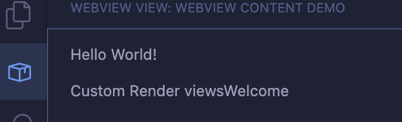

# 六、package.json 的 when 子句上下文

官方文档：https://code.visualstudio.com/api/references/when-clause-contexts

中文文档：https://liiked.github.io/VS-Code-Extension-Doc-ZH/#/references/when-clause-contexts?id=when-%E5%AD%90%E5%8F%A5%E4%B8%8A%E4%B8%8B%E6%96%87

VS Code 为元素是否处于可见和激活状态，设置了不同的上下文值。这些上下文可以禁用或者启用插件的某些命令和 UI 元素，比如菜单和视图。

比如，VS Code 用 when 子句启停命令快捷键，你可以在默认快捷键绑定 JSON 文件中找到（**首选项：打开默认键盘快捷键(JSON)**）：

```json
{
  "key": "f5",
  "command": "workbench.action.debug.start",
  "when": "debuggersAvailable && !inDebugMode"
}
```

上述内置**启动调试器**命令的快键键是 `F5`，它仅仅在适当的调试器可用（上下文中的 `debuggersAvailable` 为 true 时）且编辑器不在调试模式中（上下文中的 `inDebugMode` 为 false 时）才会启动。

## 1、条件操作符

你可以使用下列条件操作符

| 操作符                                                         | 符号   | 例子                                   |
| -------------------------------------------------------------- | ------ | -------------------------------------- | --- | --------- | --- | ----------- |
| 相等                                                           | `==`   | `"editorLangId == typescript"`         |
| 不相等                                                         | `!=`   | `"resourceExtname != .js"`             |
| 或                                                             | `      |                                        | `   | `"isLinux |     | isWindows"` |
| 且                                                             | `&&`   | `"textInputFocus && !editorReadonly"`  |
| 非                                                             | `!`    | `!editorReadonly`                      |
| 匹配（表达式 `key =~ value` 会把右侧作为正则表达式来匹配左侧） | `=~`   | `"resourceFilename =~ /docker/"`       |
| 大于                                                           | `> >=` | `"gitOpenRepositoryCount >= 1"`        |
| 小于                                                           | `< <=` | `"workspaceFolderCount < 2"`           |
| 包含                                                           | `in`   | `resourceFilename in supportedFolders` |

## 2、可用上下文变量

下面是一些`when`子句中可以使用的上下文变量，这些值最终会被解析为布尔值 true/false。

这个表并不包含所有值，你可以在键盘快键键编辑器（**首选项:打开键盘快捷键**）或者默认快捷键绑定 JSON 文件（**首选项：打开默认键盘快捷键(JSON)**）中找到所有上下文变量。

| 上下文名称                    | 何时为真                                                                                                                    |
| ----------------------------- | --------------------------------------------------------------------------------------------------------------------------- |
| **编辑器上下文**              |                                                                                                                             |
| `editorFocus`                 | 编辑器聚焦时，不管是聚焦到文本还是小部件                                                                                    |
| `editorTextFocus`             | 编辑器内的文本聚焦时（光标闪动）                                                                                            |
| `textInputFocus`              | 任何编辑器聚焦时（常规编辑器, 调试 REPL 等等).                                                                              |
| `inputFocus`                  | 任何文本输入区域聚焦时（编辑器或文本框）                                                                                    |
| `editorHasSelection`          | 编辑器中的文本被选中时                                                                                                      |
| `editorHasMultipleSelections` | 多文本区被选中时（多个光标）                                                                                                |
| `editorReadonly`              | 编辑器只读时                                                                                                                |
| `editorLangId`                | 当编辑器的[语言 ID](https://code.visualstudio.com/docs/languages/identifiers) 匹配时。比如: `"editorLangId == typescript"`. |
| `isInDiffEditor`              | 激活的编辑器处于差异编辑器状态时                                                                                            |
| `isInEmbeddedEditor`          | 在嵌入式编辑器聚焦时                                                                                                        |
| **操作系统上下文**            |                                                                                                                             |
| `isLinux`                     | 系统是 Linux 时                                                                                                             |
| `isMac`                       | 系统是 macOS 时                                                                                                             |
| `isWindows`                   | 系统是 Windows 时                                                                                                           |
| `isWeb`                       | 从 web 访问编辑器时                                                                                                         |

这里没有展示完，完整部分可以去官网查看

## 3、激活聚焦视图或面板相关的上下文变量

你可以用 when 子句检查特定视图是否是可见的

| 上下文名称    | 何时为真                                                         |
| ------------- | ---------------------------------------------------------------- |
| activeViewlet | 当视图可见时，比如`"activeViewlet == 'workbench.view.explorer'"` |
| activePanel   | 当面板可见时，比如`"activePanel == 'workbench.panel.explorer'"`  |
| focusedView   | 当聚焦到视图时，比如`"focusedView == myViewsExplorerID"`         |

视图标识：

- workbench.view.explorer - 资源文件管理器
- workbench.view.search - 搜索
- workbench.view.scm - 源控制
- workbench.view.debug - 运行
- workbench.view.extensions - 插件

面板标识:

- workbench.panel.markers - 问题
- workbench.panel.output - 输出
- workbench.panel.repl - 调试控制台
- terminal - 终端
- workbench.panel.comments - 评论
- workbench.view.search - 搜索， 当 `search.location` 设置到 `panel` 时

如果你想要在特定视图或者面板聚焦时触发 when 子句，使用 `sideBarFocus` 或 `panelFocus` 与 `activeViewlet` 或 `activiewFocus` 进行组合。

比如，下列 when 子句只会在文件资源管理器聚焦时才会为真

```json
"sideBarFocus && activeViewlet == 'workbench.view.explorer'"
```

## 4、添加自定义 when 子句上下文

如果你的插件需要使用 when 子句启动/禁用命令、菜单或者视图，而已有的上下文变量都不满足你的需求，你可以用 `setContext` 命令设置你自己的变量。

> `setContext` 命令是内置的，不可更改

1、设置上下文变量

下面的第一个例子设置键 myExtension:showMyCommand 为真，你就可以在命令中或者 when 属性中进行使用了。

```ts
vscode.commands.executeCommand('setContext', 'myExtension.showMyCommand', true)
```

第二个例子储存了一个值，那么你就可以在 when 子句中检查这个属性值是否大于 2 了。

```ts
vscode.commands.executeCommand(
  'setContext',
  'myExtension.numberOfCoolOpenThings',
  4
)
```

2、激活

这点很关键，只有激活后，才能设置才会生效。

```json
{
  "activationEvents": ["onCommand:setContext"]
}
```

3、使用

```json
{
  "contributes": {
    "views": {
      "explorer": [
        {
          "id": "nodeDependencies-demo",
          "name": "Node Dependencies Demo",
          "when": "myExtension.showMyCommand" // 使用自定义when子句上下文
        }
      ]
    }
  }
}
```

# 七、extension.ts 文件

`extension.ts`是插件工程的入口文件，也就是 webpack.config.js 中打包的入口文件，当插件被激活，即触发`package.json`中的`activationEvents`配置项时，`extension.ts`文件开始执行。

`extension.ts`文件将导出两个方法：`activate`和`deactivate`，其执行时机如下所示：

- activate: 插件被激活时执行的函数
- deactivate: 插件被销毁时调用的方法，比如释放内存等

在 `extension.ts`中对需要的功能进行注册，主要使用`vscode.commands.register...`相关的 api，来为`package.json`中的`contributes`配置项中的事件绑定方法或者监听器。

`vscode.commands.register...`相关的 api 主要有：

- vscode.commands.registerCommand() 注册命令

- vscode.languages.registerCompletionItemProvider() 代码补全

- vscode.languages.registerCodeActionsProvider() 注册一个代码操作提供者

- vscode.languages.registerCodeLensProvider()

- vscode.languages.registerHoverProvider() 代码悬浮提示

# 八、VS Code 插件生命周期

VS Code 的插件都运行在一个独立的进程里, 被称为 Extension Host, 它加载并运行插件, 让插件感觉自己好像在主进程里一样, 同时又严格限制插件的响应时间, 避免插件影响主界面进程。

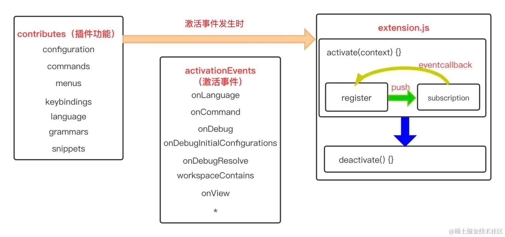

1. `activationEvents`:在`package.json`的`activationEvents`配置项中设置插件激活时机，这里设置的是`onCommand:vs-demo.helloWorld`，即输入命令`onCommand:vs-demo.helloWorld`时激活。
2. `contributes`：`package.json`中的`contributes`配置项表示这个插件增加了哪些功能，这里设置了`commands`,表示增加的命令，在这一项中声明了一个命令`vs-demo.helloWorld`。
3. `Register`:在 `extension.js` 文件中的 `activate(context)`方法中，使用`vscode.commands.registerCommand()`这一 API 为命令`vs-demo.helloWorld`绑定事件，绑定的事件为`vscode.window.showInformationMessage('Hello World from vs-demo!')`，即弹出弹框，显示 `Hello World from vs-demo!`。
4. 在命令框中输入 `vs-demo.helloWorld`，此时插件被激活，进入`extension.js`中执行`activate()`方法，由于已经在`contributes`配置项中声明了命令`vs-demo.helloWorld`,所以在`activate()`方法中为该命令绑定一个事件，由于在命令框中输入了这个命令，所以命令绑定的事件立即被触发执行，所以在 vscode 的右下角弹出了弹出框。

> 这部分摘自：[掘金](https://juejin.cn/post/7319143646586486820?searchId=202507010846088A7A9A9D7585523F934D#heading-11)

# 九、Commands 命令

官方文档：https://code.visualstudio.com/api/extension-guides/command

包含几个方法：

- `executeCommand<T>(command: string, ...rest: any[]): Thenable<T>`：执行由给定命令标识符指定的命令

- `getCommands(filterInternal?: boolean): Thenable<string[]>`：获取所有可用命令的列表。以下划线开头的命令被视为内部命令。

- `registerCommand(command: string, callback: (args: any[]) => any, thisArg?: any)`：注册一个可通过键盘快捷键、菜单项、操作或直接调用的命令。

- `registerTextEditorCommand(command: string, callback: (textEditor: TextEditor, edit: TextEditorEdit, args: any[]) => void, thisArg?: any)`：注册一个可通过键盘快捷键、菜单项、操作或直接调用的文本编辑器命令。

## 1、新建命令

### 1.1 注册一个命令

使用 `vscode.commands.registerCommand` 会把命令 ID 绑定到你插件的函数上

```ts
import * as vscode from 'vscode'

export function activate(context: vscode.ExtensionContext) {
  context.subscriptions.push(
    // 注册命令，执行回调
    vscode.commands.registerCommand(
      'myExtension.sayHello',
      (name: string = 'world') => {
        vscode.window.showInformationMessage(`Hello ${name}`)
      }
    )
  )
}
```

当执行 `Say Helllo` 命令后会在右下角打印信息

### 1.2 创建面向用户的命令

`vscode.commands.registerCommand`仅仅是将命令 id 绑定到了处理函数上，如果想让用户从**命令面板**中找到你的命令，你还需要在`package.json`中配置对应的命令`配置项(contribution)：

```json
"contributes": {
  "commands": [
    {
      "command": "myExtension.sayHello",
      "title": "Say Hello"
    }
  ]
},
```

`commands`配置告诉 VS Code 你的插件提供了一个命令，而且允许你控制命令在 UI 中的显示。

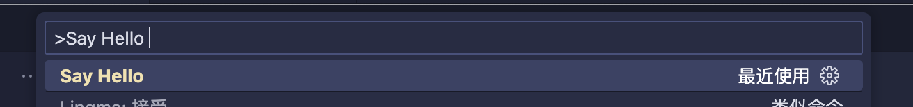

我们依旧需要使用`registerCommand`将真实的命令 id 绑定到函数上。也就是说，如果我们的插件没有激活，那么用户从*命令面板*中选择`myExtension.sayHello`也不会有任何效果。（所以一般“注册一个命令”和“创建面向用户的命令”会一起使用）

### 1.3 控制命令出现在命令面板的时机

默认情况下，所有命令面板中出现的命令都可以在`package.json`的`commands`部分中配置。不过，有些命令是场景相关的，比如在特定的语言的编辑器中，或者只有用户设置了某些选项时才展示。

`menus.commandPalette`发布内容配置运行你限制命令出现在*命令面板*的时机。你需要配置命令 ID 和一条[when 语句](https://code.visualstudio.com/docs/getstarted/keybindings#_when-clause-contexts)：

```json
{
  "contributes": {
    "menus": {
      "commandPalette": [
        {
          "command": "myExtension.sayHello",
          "when": "editorLangId == markdown"
        }
      ]
    }
  }
}
```

现在`myExtension.sayHello`命令只会出现在当用户打开 Markdown 文件才显示了。

## 2、使用命令

VS Code 内部含有大量和编辑器交互、控制 UI、后台操作的内置命令。许多插件将它们的核心功能暴露为*命令*的形式供用户或者其他插件使用。

> 内置命令可以参考：https://liiked.github.io/VS-Code-Extension-Doc-ZH/#/references/commands

### 2.1 程序性调用一个命令

[`vscode.commands.executeCommand`](https://code.visualstudio.com/api/references/vscode-api#commands.executeCommand)API 可以程序性调用一个命令，你可以通过它将 VS Code 的内置函数构建在你的插件中，比如 VS Code 内置的 Git 和 Markdown 插件中的东西。

我们看个例子 🌰：`editor.action.addCommentLine`命令可以将当前选中行变成注释(你可以偷偷把这个功能地集成到你自己的插件中哦)：

```ts
import * as vscode from 'vscode'

// 将选中行注释掉
function commentLine() {
  vscode.commands.executeCommand('editor.action.addCommentLine')
}

export function activate(context: vscode.ExtensionContext) {
  // 注册“注释当前行”命令
  context.subscriptions.push(
    // 需要在 package.json 中贡献 myExtension.commentLine
    vscode.commands.registerCommand('myExtension.commentLine', () => {
      // 调用内置的注释命令
      vscode.commands.executeCommand('editor.action.addCommentLine')
    })
  )
}
```

### 2.2 命令的 URIs

命令 URI 是执行注册命令的**链接**。它们可被用于悬停文本上的可点击链接，代码补全提示中的细节信息，甚至可以出现在 webview 中。

命令 URI 使用`command`作为协议头，然后紧跟着命令名称。比如：`editor.action.addCommentLine`的命令 URI 是：`command:editor.action.addCommentLine`。下面是一个显示在当前行注释中显示链接的悬停函数：

需要在 package.json 添加激活事件，表示当前语言为 js 时候触发

```json
"activationEvents": [
  "onLanguage:javascript"
],
```

编写悬浮函数，通过 Markdown 进行 uri 链接渲染

> `vscode.languages` 这些 api 可以在官方文档找到：https://code.visualstudio.com/api/references/vscode-api

```ts
import * as vscode from 'vscode'

export function activate(context: vscode.ExtensionContext) {
  const hover = vscode.languages.registerHoverProvider(
    'javascript',
    new (class implements vscode.HoverProvider {
      provideHover(
        _document: vscode.TextDocument,
        _position: vscode.Position,
        _token: vscode.CancellationToken
      ): vscode.ProviderResult<vscode.Hover> {
        const commentCommandUri = vscode.Uri.parse(
          `command:editor.action.addCommentLine`
        )
        const contents = new vscode.MarkdownString(
          `[\`Markdown渲染 Add comment\`](${commentCommandUri})`
        )
        // command URIs如果想在 Markdown 内容中生效, 你必须设置`isTrusted`，来创建可信的Markdown 字符
        contents.isTrusted = true

        return new vscode.Hover(contents)
      }
    })()
  )

  context.subscriptions.push(hover)
}
```

当打开一个 js 文件，悬浮到内容上会展示以下内容，点击后，该行内容会被注释掉

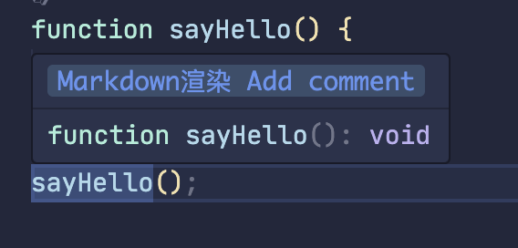

## 3、触发命令方式

- **直接通过 `vscode.commands.executeCommand` 调用命令**

- **在命令面板中执行（用户手动输入）**

- **快捷键方式触发**

```json
"contributes": {
  "keybindings": [
    {
      "command": "editor.action.addCommentLine",
      "key": "ctrl+alt+c",
      "mac": "cmd+alt+c",
      "when": "editorTextFocus"
    }
  ]
}
```

- **在状态栏添加可点击按钮**

```ts
const statusBarItem = vscode.window.createStatusBarItem(
  vscode.StatusBarAlignment.Left
)
// 状态栏文字
statusBarItem.text = `$(comment) Comment Line`
// 点击后执行editor.action.addCommentLine（注释该行）
statusBarItem.command = 'editor.action.addCommentLine'
// 显示这个状态栏按钮
statusBarItem.show()
```

- **右键菜单中调用**

```json
"contributes": {
  "menus": {
    "editor/context": [
      {
        "command": "editor.action.addCommentLine",
        "group": "navigation"
      }
    ]
  }
}
```

- **通过 markdown 渲染成链接，点击触发**（**命令的 URIs**）

> 这个在【2、使用命令 2.2 命令的 URIs】有说

这个`command:example.helloWorld` 就是命令（`vscode.commands.registerCommand('example.helloWorld)`）

```md
[命令按钮](command:example.helloWorld)
```

## 4、内置命令

例如上面的`editor.action.addCommentLine`就是内置命令，可以参考文档：

官方文档：https://code.visualstudio.com/api/references/commands

中文文档：https://liiked.github.io/VS-Code-Extension-Doc-ZH/#/references/commands

# 十、Tree View 树视图

官方文档：https://code.visualstudio.com/api/extension-guides/tree-view

树视图就是 vscode 左侧的文件树的样式，他提供 api 让你能够更方便的渲染树结构。

## 1、树视图 API 基础

### 1.1、TreeDataProvider

`TreeDataProvider` 这个 api 是创建树视图的 api，需要必须要在类中实现 `getChildren` 和 `getTreeItem` 两个方法。

- **方法**

  - `getChildren`：必选，获取子节点，需要返回一个 `TreeItem` 类型的数组。
  - `getTreeItem`：必选，获取树节点，需要返回一个 `TreeItem` 类型。
  - `getParent`：可选，返回 element 的父级。如果 element 是根的子级，则返回 null 或 undefined 。
  - `resolveTreeItem`：可选，作用是在树视图中展开某个节点时动态地更新该节点的详细信息（比如图标、描述、标签等），通常用于延迟加载或动态渲染 TreeItem 的内容。

  ```ts
  // 当你在 VS Code 树视图中点击节点 "a" 展开时，它会触发这个方法并显示你动态设置的内容。
  // NodeDepItem是继承 vscode.TreeItem 类
  resolveTreeItem(item: NodeDepItem, element: NodeDepItem, token: vscode.CancellationToken) {
    if (element.label === 'a') {
      // 动态更改 label 和 description
      item.label = 'Updated Label for A';
      item.description = 'This is a dynamic update';
      item.tooltip = 'Dynamic tooltip for A';
    }

    return item;
  }
  ```

- **事件**

  - `onDidChangeTreeData`：可选**事件**，树视图监听了 `onDidChangeTreeData` 事件，一旦触发就会重新调用 `getChildren` 等方法获取最新的树数据，从而更新 UI，可以实现刷新按钮的功能。

**NodeDepTreeProvider 的实现**：

> 这里使用 `implements` 关键字，来约束类要实现的方法。

```ts
// 使用 implements，来实现TreeDataProvider接口
class NodeDepTreeProvider implements vscode.TreeDataProvider<vscode.TreeItem> {
  getChildren(
    element?: vscode.TreeItem | undefined
  ): vscode.ProviderResult<vscode.TreeItem[]> {
    return [new vscode.TreeItem('a'), new vscode.TreeItem('b')]
  }

  getTreeItem(element: vscode.TreeItem): vscode.TreeItem {
    return element
  }

  onDidChangeTreeData?:
    | vscode.Event<
        void | vscode.TreeItem | vscode.TreeItem[] | null | undefined
      >
    | undefined = new vscode.EventEmitter<vscode.TreeItem | undefined | void>()
    .event
}
```

### 1.2、TreeItem

> 官方文档：https://code.visualstudio.com/api/references/vscode-api#TreeItem

`TreeItem` 类用来实现树视图中的一个元素，`TreeItem` 由 `TreeDataProvider` 创建，也就是在 `TreeDataProvider` 的 `getChildren` 方法中返回 `TreeItem`类型的数组。

- `constructor`**构造函数**：有两种实例创建方式：第一种：`new TreeItem(label: string | TreeItemLabel, collapsibleState?: TreeItemCollapsibleState): TreeItem`；第二种：`new TreeItem(resourceUri: Uri, collapsibleState?: TreeItemCollapsibleState): TreeItem`。这两种创建方式的区别就是参数一的不同，每个参数的意思：

  - `label: string | TreeItemLabel`：树视图中显示的元素名称
  - `resourceUri: Uri`：表示此项目的资源的 Uri（这个就是之前在 `Commands` 命令部分说的：命令 URI 是执行注册命令的**链接**）
  - `collapsibleState?: TreeItemCollapsibleState`：可选，`TreeItem` 折叠状态，默认为 `TreeItemCollapsibleState.None`

- `properties` 属性：(这里属性也非常多，就选几个常用的说吧)

  - `label`：`TreeItem` 显示的元素名称
  - `description`：`TreeItem` 显示的元素描述
  - `iconPath`：`TreeItem` 显示的图标
  - `contextValue`：`TreeItem` 的 `when` 上下文值，这可用于在树中贡献特定项的操作。例如，`TreeItem` 被赋予上下文值 `folder` 。当使用 `menus` 扩展点向 `view/item/context` 贡献操作时，你可以在 `when` 表达式中的 `viewItem` 键指定上下文值，如 `viewItem == folder`。

  ```json
  "contributes": {
    "menus": {
      "view/item/context": [
        {
          "command": "extension.deleteFolder",
          "when": "viewItem == folder"
        }
      ]
    }
  }
  ```

  - `tooltip`：`TreeItem` 显示的元素提示
  - `command`：当 `TreeItem` 被选中时应该执行的命令
  - `collapsibleState`：`TreeItem` 折叠状态

**NodeDepItem 的实现**：

> 使用 `extends` 关键字继承 `vscode.TreeItem` 的属性和方法。

```ts
// 定义树结构子节点
class NodeDepItem extends vscode.TreeItem {
  constructor(public readonly label: string) {
    super(label)
    // this上有很多属性，配置节点的信息
    this.description = 'nodeDepItem' + label
  }

  // this.iconPath
  iconPath = {
    light: path.join(__filename, '..', '..', 'media', 'icon.svg'),
    dark: path.join(__filename, '..', '..', 'media', 'icon.svg')
  } as any
}
```

### 1.3 注册 TreeDataProvider

注册 `TreeDataProvider` 有两种方法：`registerTreeDataProvider` 和 `createTreeView`，两者都可以创建树视图，但它们的用途和职责是不同的。

| 特性                                           | `createTreeView`           | `registerTreeDataProvider`       |
| ---------------------------------------------- | -------------------------- | -------------------------------- |
| **作用**                                       | 创建一个可视化的树视图界面 | 注册一个树数据提供者（提供数据） |
| **是否创建 UI 组件**                           | ✅ 是                      | ❌ 否                            |
| **是否需要 TreeDataProvider**                  | ✅ 需要                    | ✅ 需要                          |
| **是否暴露 view 对象**                         | ✅ 是                      | ❌ 否                            |
| **可否绑定右键菜单、viewItemResolve 等扩展点** | ✅ 可以                    | ❌ 不行                          |

官方文档的描述是：如果你想在视图上执行一些 UI 操作，可以使用 `window.createTreeView` 而不是 `window.registerTreeDataProvider`。这将提供对视图的访问，你可以使用它来执行视图操作。

```ts
// registerTreeDataProvider
vscode.window.registerTreeDataProvider(
  'nodeDependencies-demo',
  new DepNodeProvider()
)
// createTreeView
vscode.window.createTreeView('nodeDependencies-demo', {
  treeDataProvider: new DepNodeProvider()
})
```

### 1.4 案例 1 - 创建基础树视图

1、我们先把容器树视图的渲染容器创建出来，在 package.json 中添加如下代码：意思是在 `explorer`（文件资源管理器位置）贡献视图。

```json
{
  "contributes": {
    "views": {
      "explorer": [
        {
          "id": "nodeDependencies-demo",
          "name": "🚀 Node Dependencies Demo",
          "icon": "media/icon.svg"
        }
      ]
    }
  }
}
```

2. extension.ts 中添加如下代码：

```ts
import * as path from 'path'
import * as vscode from 'vscode'

export function activate(context: vscode.ExtensionContext) {
  vscode.window.createTreeView('nodeDependencies-demo', {
    treeDataProvider: new NodeDepTreeProvider()
  })
}

// 使用 implements，来实现TreeDataProvider接口
class NodeDepTreeProvider implements vscode.TreeDataProvider<NodeDepItem> {
  getChildren(
    element?: NodeDepItem | undefined
  ): vscode.ProviderResult<NodeDepItem[]> {
    return [new NodeDepItem('a'), new NodeDepItem('b')]
  }

  getTreeItem(element: NodeDepItem): vscode.TreeItem {
    return element
  }
}

// 定义树结构子节点
class NodeDepItem extends vscode.TreeItem {
  constructor(public readonly label: string) {
    super(label)
    // this上有很多属性，配置节点的信息
    this.description = 'nodeDepItem' + label
  }

  // this.iconPath
  iconPath = {
    light: path.join(__filename, '..', '..', 'media', 'icon.svg'),
    dark: path.join(__filename, '..', '..', 'media', 'icon.svg')
  } as any
}
```

### 1.5 案例 2 - 创建多级树视图

创建一个像资源管理器那样可以折叠的树视图，只需要在 `extension.ts` 稍作修改即可：

需要在 `NodeDepItem`（也就是 `TreeItem`）中添加 `collapsibleState` 属性来控制节点的折叠状态，并传入 `children` 渲染多级子节点。

```ts
class NodeDepTreeProvider implements vscode.TreeDataProvider<NodeDepItem> {
  getChildren(
    element?: NodeDepItem | undefined
  ): vscode.ProviderResult<NodeDepItem[]> {
    if (!element) {
      // 根节点
      return [
        new NodeDepItem('Level1-1', [
          new NodeDepItem('Level2-1', []),
          new NodeDepItem('Level2-2', [])
        ]),
        new NodeDepItem('Level1-2', [])
      ]
    } else {
      // 非叶子节点有子节点
      return element.children.length > 0 ? element.children : null
    }
  }

  getTreeItem(element: NodeDepItem): vscode.TreeItem {
    return element
  }
}

// 定义树结构子节点
class NodeDepItem extends vscode.TreeItem {
  constructor(
    public readonly label: string,
    // 通过为 NodeDepItem 添加 children 属性并在 getChildren 中判断层级关系，可以轻松实现多级菜单树。
    public readonly children: NodeDepItem[] = []
  ) {
    super(label)
    this.description = 'nodeDepItem' + label
    // 当某个节点有 children 时，会自动变为可展开状态。
    this.collapsibleState =
      children.length > 0
        ? vscode.TreeItemCollapsibleState.Collapsed
        : vscode.TreeItemCollapsibleState.None
  }

  // ...
}
```

效果展示：

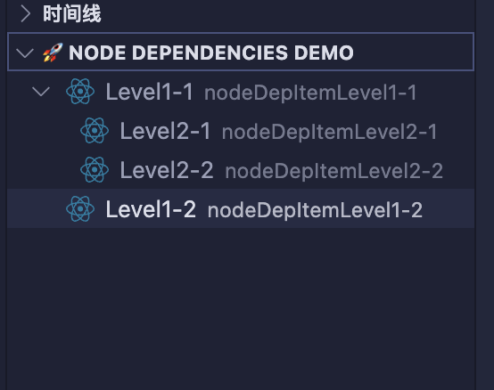

源码在 `/extension-guides/tree-view` 中

# 十一、其他扩展指南

这里只列出了平时用的多，且好复现的，还有很多扩展指南功能，可以自行参考文档。

官方文档：https://code.visualstudio.com/api/extension-guides/overview

项目实战可以参考这个作者的，底部有项目案例：https://juejin.cn/post/7303451052598083622?searchId=202507010846088A7A9A9D7585523F934D#heading-7

# 十二、插件发布

## 发布准备

1. 安装依赖

文档是 `-g` 全局安装，我喜欢安装在项目依赖中，使用脚本进行调用（因为我的插件需要使用 github action 进行 cicd）

```bash
pnpm i vsce -D
```

2. 新增脚本

配置脚本，以及配置 `publisher` 发布者

```json
{
  "publisher": "xiaotianna",
  "scripts": {
    "build:vsix": "vsce package"
  }
}
```

3. 登录 Azure DevOps

Visual Studio Code 使用 Azure DevOps 提供其 Marketplace 服务

网站入口：[https://dev.azure.com/](https://dev.azure.com/)

登录后点击下图页面，创建 token（需要记住，关闭后就没有了）

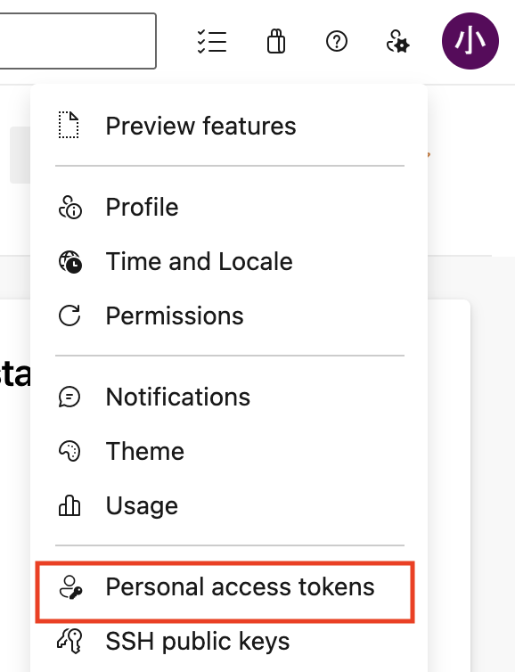

创建发布者：[https://marketplace.visualstudio.com/manage/createpublisher](https://marketplace.visualstudio.com/manage/createpublisher)

注意：进入页面后配置的 `name` 需要和 `package.json` 中配置的 `publisher` 一致。

查看发布者：[https://marketplace.visualstudio.com/manage/publishers/](https://marketplace.visualstudio.com/manage/publishers/)

## 自动发布

1. 登录创建的发布者

```bash
vsce login <publisher id>

# 会让你输入创建的token
https://marketplace.visualstudio.com/manage/publishers/
Personal Access Token for publisher '<publisher id>': ****************************************************

The Personal Access Token verification succeeded for the publisher '<publisher id>'.
```

2. 打包

```bash
# vsce package
pnpm build:vsix
```

3. 发布

```bash
vsce publish
```

## 手动发布

因为我本地使用 `vsce package` 命令会报错，我采用的是将代码放入 `github`，使用 cicd 进行打包，获取到这个打包后的插件文件（后文会说如何配置），接着我们打开这个链接：[https://marketplace.visualstudio.com/manage](https://marketplace.visualstudio.com/manage)

注意选对发布者哦，图形化页面点击上传即可

# 十三、使用 Github Actions 构建 CICD 流水线

在根目录新建 `.github/workflows/build-vsix.yml` 文件，配置如下：

```yml
name: Build VSIX and Publish Release

on:
  push:
    branches:
      - main
  workflow_dispatch:

jobs:
  build:
    runs-on: ubuntu-latest

    steps:
      - name: Checkout repository
        uses: actions/checkout@v4

      - name: Setup Node.js
        uses: actions/setup-node@v4
        with:
          node-version: '18.x'

      #  安装依赖
      - name: Install dependencies
        run: |
          npm install
      # 安装打包插件
      - name: Install vsce
        run: |
          npm install -g @vscode/vsce
      # 将插件打包成 .vsix 文件
      - name: Build project
        run: |
          npm run build:vsix
      # 获取插件版本
      - name: Get package version
        id: get_version
        run: |
          VERSION=$(node -p "require('./package.json').version")
          echo "version=$VERSION" >> $GITHUB_ENV
      # 将产物文件（也就是打包后的.vsix文件）输出到 artifacts 中（流水线产物，可以下载）
      - name: Upload VSIX as Artifact
        uses: actions/upload-artifact@v4
        with:
          name: auto-css-vars-vsix
          path: auto-css-vars-${{ env.version }}.vsix
      # 创建 GitHub Release
      - name: Create GitHub Release
        id: create_release
        uses: actions/create-release@v1
        env:
          GITHUB_TOKEN: ${{ secrets.GITHUB_TOKEN }}
        with:
          tag_name: v${{ env.version }}
          release_name: Release ${{ env.version }}
          draft: false
          prerelease: false
      # 上传 Release Asset
      - name: Upload Release Asset
        id: upload_release_asset
        uses: actions/upload-release-asset@v1
        env:
          GITHUB_TOKEN: ${{ secrets.GITHUB_TOKEN }}
        with:
          upload_url: ${{ steps.create_release.outputs.upload_url }}
          asset_path: auto-css-vars-${{ env.version }}.vsix
          asset_name: auto-css-vars-${{ env.version }}.vsix
          asset_content_type: application/octet-stream
```

上面的内容还是挺多的，我们将内容进行分解：

1. Install dependencies：也就是执行我们的 `npm install` 命令
2. Install vsce：安装打包插件，也就是 `npm install -g @vscode/vsce`
3. Build project：将插件打包成 .vsix 文件，也就是 `npm run build:vsix`
4. Get package version：获取插件的版本号，去读取 package.json 文件中的 version 字段
5. Upload VSIX as Artifact：将产物文件（也就是打包后的.vsix 文件）输出到 artifacts 中（流水线产物，可以下载）
6. Create GitHub Release：创建 GitHub Release
7. Upload Release Asset：上传 Release Asset

- 步骤 5 是输出流水线的产物文件

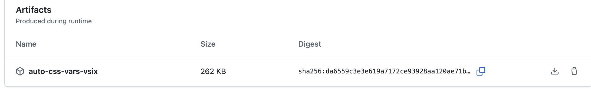

- 步骤 6、7 步骤是创建 GitHub Release 的步骤

> ⚠️ 该功能需要在仓库的设置中开启 `Workflow permissions`，在 `【你的仓库路径】/settings/actions` 页面，勾选 `Read and write permissions`。

每次推送 git，需要更新一下 package.json 的 version，不然会提示版本号重复

> 我开发的插件是一个css变量自动转换的插件，当我们书写了很多css变量，来回两个文件切换查看非常麻烦，所以做了这样一个插件提示我们的开发效率。
> 
> 插件名：auto-css-vars
> 
> 仓库地址：https://github.com/xiaotianna/auto-css-vars-vs-plugin（也可在本项目的demo中找到）
>
> 插件地址：https://marketplace.visualstudio.com/items?itemName=xiaotianna.auto-css-vars
